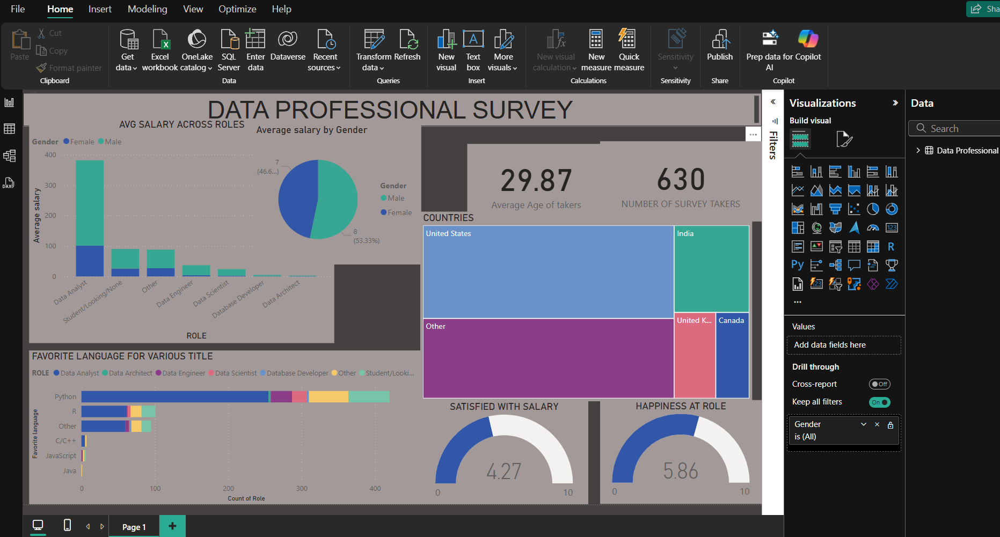

# Data Profession Survey - Power BI Dashboard

This project analyzes a dataset from a Data Profession Survey using Microsoft Power BI. The goal was to explore trends, distributions, and patterns within data-related roles.



---

## 📊 Dashboard Highlights

- Profession distribution among respondents
- Salary ranges by region
- Tools used by professionals


---

## 🧠 Insights Discovered

- Data  Analysts dominate the field.
- Python is the most common tool.
- Majority of are happy at their jobs.
- Salary varies significantly by region and experience.
- Males dominate the data field
---

## 🛠️ Tools Used

- **Microsoft Power BI** – for data cleaning and dashboard creation
- **Excel** – raw data format and minor preprocessing
- **Git + GitHub** – version control and portfolio hosting

---

## 📁 File Structure

project/
├── project.pbix # Power BI file
├── dashboard.png # Dashboard screenshot
├── README.md # This file

yaml
Copy
Edit

---

## 🚀 How to Use

1. Clone the repository:
   ```bash
   git clone https://github.com/Kanyira/Power-bi-dashboard.git
